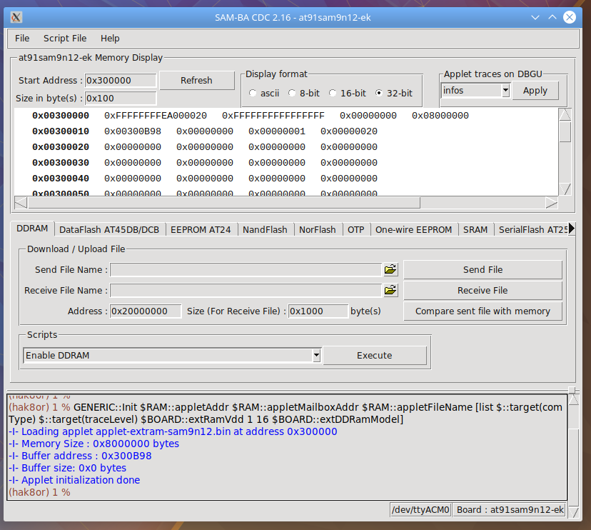
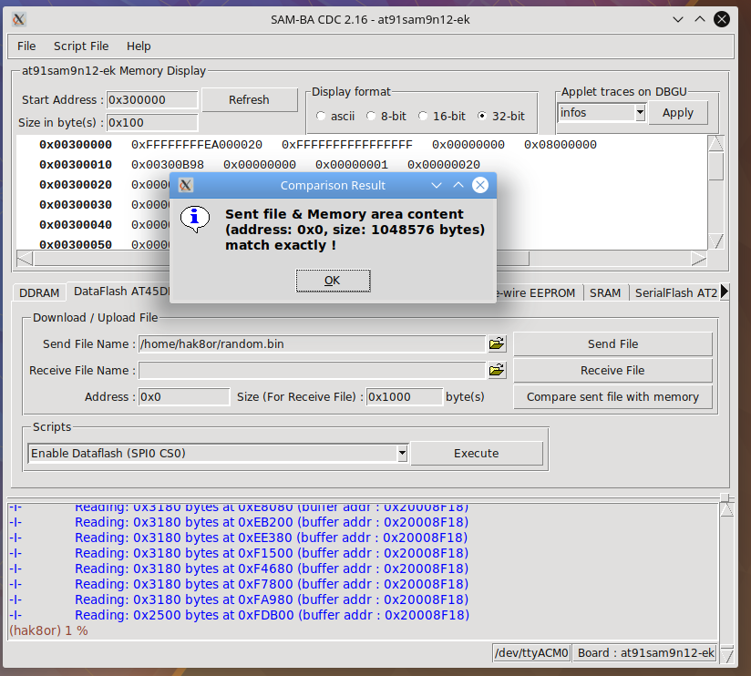

# SAM-BA

## The heck is SAM-BA?

So we have our board working enough to get the in ROM bootloader running, great! But how do we actually get some code onto DataFlash, and what about booting into Linux? Most importantly, what about initializing DRAM?

Thankfully, almost all vendors release tools that interact with software in ROM. These tools can use the software in ROM to initialize DRAM, erase flash on DataFlash, NandFlash, NOR Flash, and even modify OTP (One Time Programmable) bits in the IC. Atmel's tool for the AT91 series of chips is called SAM-BA, of which they have two versions. First is an open source command line only [version](https://github.com/atmelcorp/sam-ba) which while looking fantastic (yay for scripting), it doesn't support our old SAM9N12, and adding support doesn't seem trivial.

Next is the version we will be using, the original GUI version from [here](http://www.at91.com/linux4sam/bin/view/Linux4SAM/SoftwareTools#SAM_BA). The documentation for SAM-BA by Atmel is fantastic in terms of how to download it and get it running, so no use for me to say what's been said there other than giving a small summary.

SAM-BA works by you plugging in a USB cable from your desktop to the AT91SAM SOC's USB Device port (the board looks like a device from the perspective of your machine, not the opposite). The SAM-BA tool will communicate with the ROM based bootloader by using a mailbox-esque setup with some shared memory in SRAM of the SOC. The user can write "applets" (just ARM executables) which SAM-BA sends to DRAM and executes on the device. These applets can be used to initialize DRAM or modify NAND Flash. Atmel also helpfully includes an easy way to modify these applets and then recompile them.

## DRAM and DataFlash

DRAM is necessary because almost all the applets are designed to run from DRAM instead of SRAM. When starting SAM-BA, the tool automatically initializes DRAM and seems to do a quick small check to ensure DRAM is working, but you can manually call DRAM initialization anyways.



You can also send a file (don't use just 0's or 1's, use random data as below) to DRAM and then have SAM-BA do a comparison to further verify DRAM's functionality with your board design.

```bash
# Create one megabyte of random data using DD.
dd if=/dev/urandom of=randomstuff.bin bs=1 count=4M
```

Next up we have to flash some data to dataflash (32 Megabits) to ensure that is working. Why not NAND flash since we have so much more of it? Even after ensuring the pin setup is correct (NAND Flash is on diffirent pins than DRAM as per evaluation board), communication fails. This is likely due to soldering issues of the BGA package.

Using the random data generated earlier, flash that to DataFlash (after running "Enable Dataflash") and then do a compare to ensure Dataflash is working reliably. Don't skip this or you may end up spending nights debugging the wrong thing as your storage medium being faulty leads to all sorts of very hard to track down bugs.


