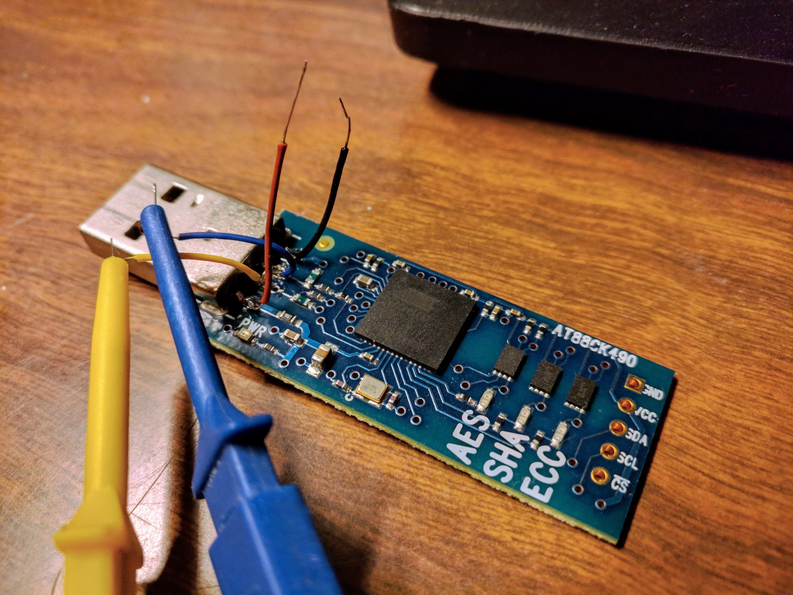
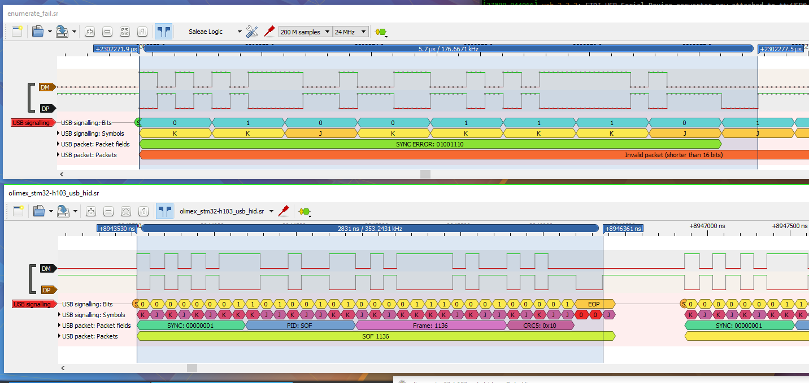
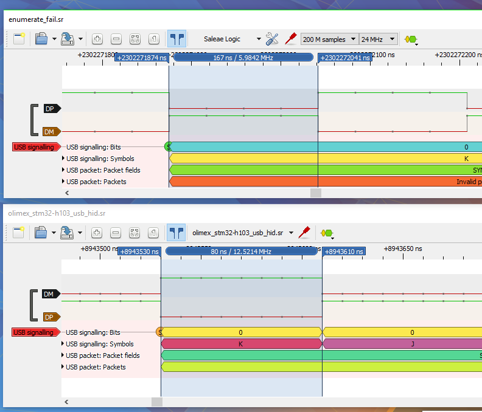

# USB

Our board has two USB ports, one hardwired to be a USB slave (connect to a USB Host like your desktop), and the other being a USB OTG port (can run as both a slave and host). The underlying peripheral hardware in the SOC is designed to work with the [OHCI standard](https://wiki.osdev.org/Open_Host_Controller_Interface). Since this port is USB 2.0, This results in the registers used to access the device being the same across all OHCI implementations and therefore being able to use a common driver. This is why in the kernel the OHCI driver has been enabled.

So, we should be able to just plug in our USB wifi dongle and it should work, right?

```none
# echo "Hello world"
Hello world
# usb 1-1: new full-speed USB device number 2 using at91_ohci
usb 1-1: device descriptor read/64, error -62
usb 1-1: device descriptor read/64, error -62
usb 1-1: new full-speed USB device number 3 using at91_ohci
usb 1-1: device descriptor read/64, error -62
usb 1-1: device descriptor read/64, error -62
usb usb1-port1: attempt power cycle
usb 1-1: new full-speed USB device number 4 using at91_ohci
usb 1-1: device not accepting address 4, error -62
usb 1-1: new full-speed USB device number 5 using at91_ohci
usb 1-1: device not accepting address 5, error -62
usb usb1-port1: unable to enumerate USB device
echo "aw :("
aw :(
```

We see a few things here.

- The correct driver (at91_ohci) is being used for the peripheral.
- The correct USB port is being used.
- Correctly recognizing USB full-speed capability.
- Driver is giving USB device an address during enumeration but device fails.
- Device descriptor read (part of enumeration process) is failing.

The last point shouldn't ever really happen, it means the Host is asking the device for simple data but the host is not getting anything back. Usually this means there is a communication issue, like a bad cable or the USB slave is genuinely not replying (maybe failed). So what the heck is error ```-62```? Searching around the kernel source we will hit ```errno.h``` which gives an error code for various potential errors. In our case the error is "Timer expired" as seen [here](https://github.com/torvalds/linux/blob/38c23685b273cfb4ccf31a199feccce3bdcb5d83/include/uapi/asm-generic/errno.h#L45). Then we have [this](https://github.com/torvalds/linux/blob/204f144c9fcac355843412b6ba1150086488a208/Documentation/driver-api/usb/error-codes.rst) helpful guide which confirms our suspicion, the explanation for the code is "No response packet received within the prescribed bus turn-around time.".

## Debugging

So we know the correct driver is being loaded on the correct USB port, and the USB device is being recognized as a full speed capable. The full speed part is important, as it means that the ```D+``` connection is being received correctly (USB full speed devices have a 1.5k ohm pullup resistor on D+ as per [standard](http://www.beyondlogic.org/usbnutshell/usb2.shtml)), therefore it is unlikely to be a pin mux'ing issue. The USB device does work in a laptop or desktop, so it's definitely not dead. Plugging in other USB devices gives the same issue. What else can we do?

### Logic Sniffer

Enter a Logic Sniffer. This is an indispensable tool which should be sitting right next to your oscilloscope. Normally most places that are willing to invest into their equipment have at least one very nice oscilloscope with the ability to decode signals like SPI/I2C/Serial and more. But the fancier scopes that sample fast enough can decode the fancier protocols like USB and even PCI-E, but they are fairly pricey (easily $10,000 and more). Instead, logic sniffers can be used which tend to be cheaper because all they do is measure HIGH/LOW states, not the signal in 256 (or more) voltage levels.

Thankfully there are logic sniffers out there like the [DSLogic](http://www.dreamsourcelab.com/dslogic.html) which can measure signals up to 400 Mhz for **only** $100 and work with the amazing open source tool [Sigrok](https://sigrok.org/). The best part about Sigrok is it's open source and actually works, including the moderatly intuitve [Pulse View](https://sigrok.org/wiki/PulseView) that lets you graphically view the signal and has many decoders built in, including USB 2.0! We want to view the D+/D- pair from the USB bus, so I grabbed a random USB device I had laying around and soldered in some wires. Yes this totally ruins signal integrity but all we want to do is get a rough idea of what's going on.



Thankfully there is an example capture for USB communications, including the pairing process, so we have something to compare to.



Yeah, that looks somewhat wonky, why are the potentially decoded bits of our signal not on the edge transitions and instead over more than 1 transition? Why is the decoded packet extending way beyond our data transitions and, most importantly, why is the raw packet (not decoded, just the bits) taking twice as long as our known to be good capture? Let's look at how long the bit duration is.



The heck? Our bit duration is roughly 167 nanoseconds while the known to be good capture says 80 nanoseconds. This is clearly a timing issue on our board. Seeing as how it's a nice clean half speed, maybe it's a clock divider being set incorrectly somewhere. For USB 2.0 Full speed, most peripherals need a 48 Mhz clock input, so what might be happening is the USB peripheral is being fed a 24 Mhz clock instead of 48 Mhz, which would explain the half speed.

## USB Clocking

Clocking in general these days for even small micro controllers is not trivial, with a clock tree consisting of many different nodes each with it's own frequency limitations. To turn a peripheral on or off usually consists of "gating off" a device, meaning to enable or disable the clock for a peripheral. Furthermore, you have many multiplexers to control what part of the clock tree gets it's clock from what source, and then throw in dividers to make it even more fun. To put it simply, clock trees are complicated.

For this SOC, the relevant parts of the clock tree are as follows:

```
16 MHz oscillator -- (MAINCK) --> PLLA
                        \-----> PLLB (Dedicated for USB)
                                    \-- (PLLBCK) --> USB Clock controller
                                                            \-- (UHPCLK) --> USB Host
```

Looking at this, we are expecting PLLB to be generating 48 Mhz or higher from a 16 Mhz frequency, therefore setting the PLL multiplier (actually divider based on how a PLL works) of at least 3x. There are a few spots where we can look into what the code assumes the various clocks are set to, one of which being in ```drivers/usb/host/ohci-at91.c``` [here](https://github.com/torvalds/linux/blob/844056fd74ebdd826bd23a7d989597e15f478acb/drivers/usb/host/ohci-at91.c#L78).

```c
// drivers/usb/host/ohci-at91.c
static void at91_start_clock(struct ohci_at91_priv *ohci_at91)
{
    if (ohci_at91->clocked)
        return;

    clk_set_rate(ohci_at91->fclk, 48000000);
    clk_prepare_enable(ohci_at91->hclk);
    clk_prepare_enable(ohci_at91->iclk);
    clk_prepare_enable(ohci_at91->fclk);
    ohci_at91->clocked = true;
}
```

What's hclk, iclk, and fclk you ask? Doesn't say there, so let's try to find the struct definition of ```ohci_at91```!

```c
struct ohci_at91_priv {
    struct clk *iclk;
    struct clk *fclk;
    struct clk *hclk;
    bool clocked;
    bool wakeup;        /* Saved wake-up state for resume */
    struct regmap *sfr_regmap;
};
```

Great, no comments. But wait, turns out that if those clocks fail to be found then the driver reports an error!

```c
/**
 * usb_hcd_at91_probe - initialize AT91-based HCDs
 * Context: !in_interrupt()
 *
 * Allocates basic resources for this USB host controller, and
 * then invokes the start() method for the HCD associated with it
 * through the hotplug entry's driver_data.
 */
static int usb_hcd_at91_probe(const struct hc_driver *driver,
            struct platform_device *pdev)
{
    // .....

    ohci_at91->iclk = devm_clk_get(dev, "ohci_clk");
    if (IS_ERR(ohci_at91->iclk)) {
        dev_err(dev, "failed to get ohci_clk\n");
        retval = PTR_ERR(ohci_at91->iclk);
        goto err;
    }
    ohci_at91->fclk = devm_clk_get(dev, "uhpck");
    if (IS_ERR(ohci_at91->fclk)) {
        dev_err(dev, "failed to get uhpck\n");
        retval = PTR_ERR(ohci_at91->fclk);
        goto err;
    }
    ohci_at91->hclk = devm_clk_get(dev, "hclk");
    if (IS_ERR(ohci_at91->hclk)) {
        dev_err(dev, "failed to get hclk\n");
        retval = PTR_ERR(ohci_at91->hclk);
        goto err;

    // .......
}
```

So all we really learn from this is ```fclk``` seems to be ```uhpck``` which is after both the PLL and USB peripheral clock divider.

## Common Clock Framework

Linux has a framework to work with clock trees, including handling depedancies and propogating rate changes to relevant nodes. Each clock has an operations struct containing function pointers to various supported USB operations. In our case, we have operations defined for both [PLLB](https://github.com/torvalds/linux/blob/58e4411b2d05bea9992fd8ee510f696b73d314c1/drivers/clk/at91/clk-pll.c#L290) (PLL dedicated for USB) and the USB peripheral clock [divider](https://github.com/torvalds/linux/blob/58e4411b2d05bea9992fd8ee510f696b73d314c1/drivers/clk/at91/clk-usb.c#L186). LWN has a fantastic [article](https://lwn.net/Articles/472998/) on this framework.

```c
// linux/drivers/clk/at91/clk-usb.c
static const struct clk_ops at91sam9n12_usb_ops = {
    .enable = at91sam9n12_clk_usb_enable,
    .disable = at91sam9n12_clk_usb_disable,
    .is_enabled = at91sam9n12_clk_usb_is_enabled,
    .recalc_rate = at91sam9x5_clk_usb_recalc_rate,
    .determine_rate = at91sam9x5_clk_usb_determine_rate,
    .set_rate = at91sam9x5_clk_usb_set_rate,
};

// linux/drivers/clk/at91/clk-pll.c
static const struct clk_ops pll_ops = {
    .prepare = clk_pll_prepare,
    .unprepare = clk_pll_unprepare,
    .is_prepared = clk_pll_is_prepared,
    .recalc_rate = clk_pll_recalc_rate,
    .round_rate = clk_pll_round_rate,
    .set_rate = clk_pll_set_rate,
};
```

Looking around, it looks like the PLL peripheral itself is being modified only through ```clk_pll_prepare()``` instead of ```clk_pll_set_rate()```. This is to handle when the PLL peripheral is not yet enabled (powered off) but wanting to modify the divisor and multiplier. When powered off, register access would result in bus faults. The USB clock divider instead has it's peripheral changed immediatly in it's ```set_rate()```.

```c
static int clk_pll_set_rate(struct clk_hw *hw, unsigned long rate,
                unsigned long parent_rate)
{
    struct clk_pll *pll = to_clk_pll(hw);
    long ret;
    u32 div;
    u32 mul;
    u32 index;

    ret = clk_pll_get_best_div_mul(pll, rate, parent_rate,
                        &div, &mul, &index);
    if (ret < 0)
        return ret;

    pll->range = index;
    pll->div = div;
    pll->mul = mul;

    return 0;
}

// ....

static int clk_pll_prepare(struct clk_hw *hw)
{
    struct clk_pll *pll = to_clk_pll(hw);
    // ...
    regmap_update_bits(regmap, offset, layout->pllr_mask,
            pll->div | (PLL_MAX_COUNT << PLL_COUNT_SHIFT) |
            (out << PLL_OUT_SHIFT) |
            ((pll->mul & layout->mul_mask) << layout->mul_shift));

    while (!clk_pll_ready(regmap, pll->id))
        cpu_relax();

    return 0;
}
```

## The Issue

When a rate change is requested, then the request gets propogated to relevant nodes in the clock tree. In our case, we are modfying ```fclk``` which is actually the USB peripheral **after** the PLL and USB clock divider. To get the clock of the node, the operation ```recalc_rate()``` is called. For the PLL, we see that the cached values (from the struct) are not being used, and instead the hardware itself is queried.

```c
static unsigned long clk_pll_recalc_rate(struct clk_hw *hw,
                        unsigned long parent_rate)
{
    struct clk_pll *pll = to_clk_pll(hw);
    unsigned int pllr;
    u16 mul;
    u8 div;

    regmap_read(pll->regmap, PLL_REG(pll->id), &pllr);

    div = PLL_DIV(pllr);
    mul = PLL_MUL(pllr, pll->layout);

    if (!div || !mul)
        return 0;

    return (parent_rate / div) * (mul + 1);
}
```

While ```recalc_rate()``` is documented in the kernel as querying the hardware, in our case it is not in sync if it is called between ```set_rate()``` and ```prepare()```. Therefore, when the USB divider has to be configured during the requested rate propogation, it will call ```recalc_rate()``` and will get a non sync'd clock rate back.

In our case, PLLB is being configured to run at 96 Mhz on boot before this call. Then the OHCI driver requests a 48 Mhz clock for the USB peripheral, which has the PLL set it's **cached** MUL and DIV values (via ```set_rate()```) approriately. Then the USB clock divider queries it's parent node (the PLL) for it's clock rate, which will return the current hardware configured clock (96 Mhz in this case). The PLL divider sets it's divider to /2 to get 48 Mhz.

Then the OHCI driver calls ```prepare_and_enable()``` on the clock, resulting in the PLL applying the cached MUL and DIV values to the PLL peripheral, changing the PLL frequency from 96 Mhz to 48 Mhz. But the USB clock divider is still /2, giving a 24 Mhz frequency, hence the USB device running at half speed.

## The Fix

The fix involves having ```recalc_rate()``` for the PLL use the cached values instead of querying the hardware. While this goes directly against the kernel documentation, it seems to sometimes happen. For example, the Renesas clock driver [does](https://github.com/torvalds/linux/commit/3092d3b8e56e09ff74d7ef9f1c34a4c358e9f0fe) this and seems to have [gone](https://spinics.net/lists/linux-renesas-soc/msg00968.html) through.

So, all that needs to be done is to use the MUL and DIV values from the PLL struct.

```c
static unsigned long clk_pll_recalc_rate(struct clk_hw *hw,
                        unsigned long parent_rate)
 {
    struct clk_pll *pll = to_clk_pll(hw);
-   unsigned int pllr;
-   u16 mul;
-   u8 div;
-
-   regmap_read(pll->regmap, PLL_REG(pll->id), &pllr);
-
-   div = PLL_DIV(pllr);
-   mul = PLL_MUL(pllr, pll->layout);
-
-   if (!div || !mul)
-      return 0;
-
-   return (parent_rate / div) * (mul + 1);
+
+   return (parent_rate / pll->div) * (pll->mul + 1);
 }
```

Further exploring shows that this was [fixed](http://lists.infradead.org/pipermail/linux-arm-kernel/2014-September/283501.html) years ago and was accepted, but later [undone](https://github.com/torvalds/linux/commit/1bdf02326b71eae7e9b4b335b881856aaf9d1af6#diff-59deeffcefca5a5972c4ab07b6d478deL155).

Now we plug it in and what do we get?

```none
usb 1-1: new full-speed USB device number 3 using at91_ohci
usb 1-1: New USB device found, idVendor=0cf3, idProduct=9271
usb 1-1: New USB device strings: Mfr=16, Product=32, SerialNumber=48
usb 1-1: Product: USB2.0 WLAN
usb 1-1: Manufacturer: ATHEROS
usb 1-1: SerialNumber: 12345
```

Yay! Now that we have USB working, we can add networking and play with some packages to make this system more fun.
